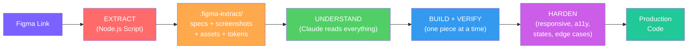
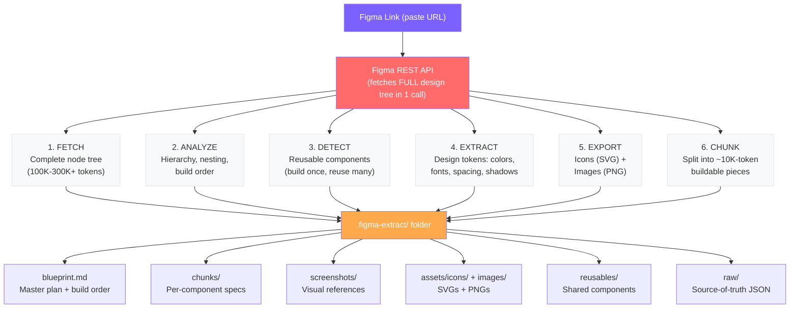
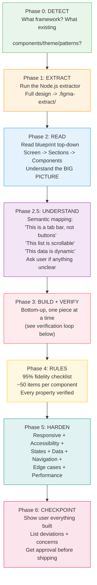
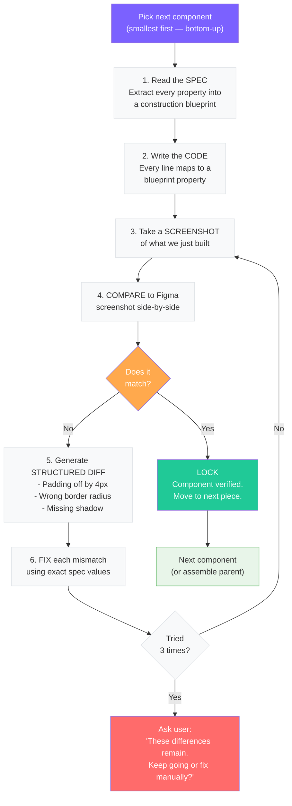
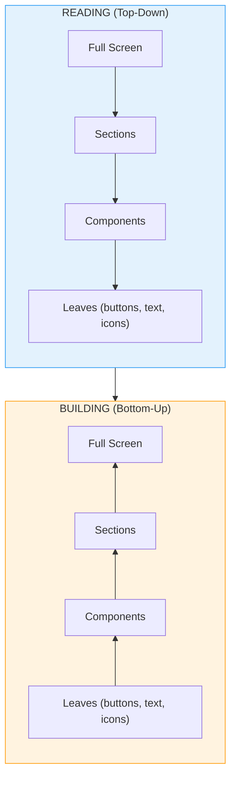
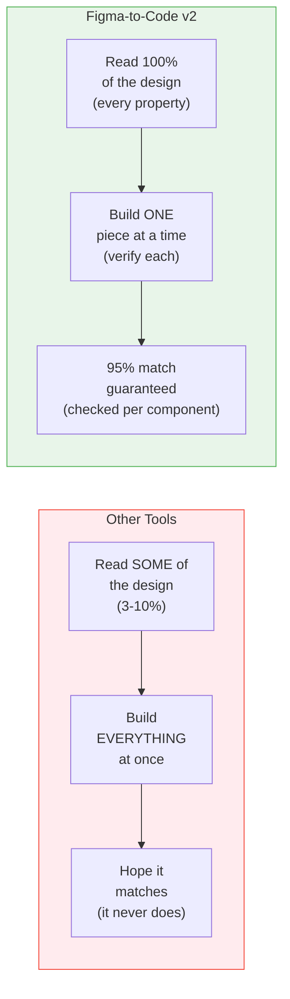
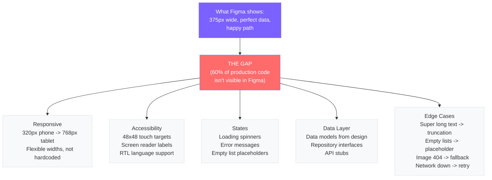
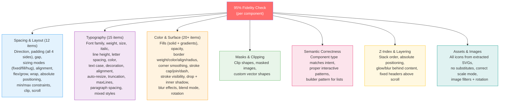

# Figma to Code v2

**Turn any Figma design into real, production-ready code — automatically.**

Works with **React**, **React Native**, and **Flutter**.

---

## What Does This Do? (The Simple Version)

Imagine you drew a beautiful app screen in Figma — buttons, colors, fonts, icons, everything laid out perfectly.

Now someone needs to turn that drawing into actual code that runs on a phone or browser. Normally a developer would stare at the design, try to manually copy every color and spacing value, miss a bunch of details, and end up with code that looks "close but not quite right."

**This plugin does all of that automatically — and gets it 95% right.**

It reads every single detail from your Figma design, organizes it into neat chunks, and then builds the code piece by piece — checking each piece against the original design before moving on.

---

## The Big Picture — End to End Flow



---

## How It Works — Two Stages

### Stage 1: Extract Everything From Figma

Before writing a single line of code, a Node.js script reads the **ENTIRE** Figma design via REST API — every layer, every property, every asset.



### Stage 2: Build the Code (7 Phases)

Claude reads the extracted specs and builds production code — not all at once, but one verified piece at a time.



### The Verification Loop (The Secret Sauce)

This is what makes the output accurate. Every single component goes through this loop before it's considered done:



### Read Top-Down, Build Bottom-Up

This is a critical concept — the system reads the design like a book (big picture first), but builds like LEGOs (small pieces first):



**Why?** Reading top-down gives you context ("this is a settings page with 3 sections"). Building bottom-up gives you precision ("this button is exactly 44px tall with 12px padding and #7B61FF background"). Context prevents mistakes. Precision prevents "close enough."

---

## Why This Is Different (Key Differentiators)

### The Core Problem Everyone Else Gets Wrong



### 5 Things That Make This Work Where Others Fail

#### 1. Zero Data Loss

| What happens | Other tools | This plugin |
|---|---|---|
| Design size | Truncated at ~10K tokens | Full tree fetched (100K-300K+) |
| Style properties | Silently drops borderRadius, shadows, letterSpacing, gradients... | Captures **every** Figma property (~50+ categories) |
| Assets | One-by-one, often fails | Batch exported, smart-filtered |

> **Real example:** A typical app screen has 1,500-2,000 nodes. MCP tools see ~100 of them. This plugin sees all 2,000.

#### 2. Verification Loop (Not "Build and Pray")

Every other tool builds the code and hopes for the best. This plugin **screenshots what it built**, compares it to the Figma screenshot, finds every mismatch, and fixes them — up to 3 times per component. Nothing ships unverified.

#### 3. Semantic Understanding

Other tools see "4 rectangles in a row." This plugin understands "that's a tab bar." Why does it matter?

- Tab bar → proper `TabBar` widget with navigation state
- 4 rectangles → 4 hardcoded `Container` widgets that do nothing

This difference is the gap between a screenshot and real software.

#### 4. Smart Asset Filtering

A typical Figma design has ~1,500 vector nodes. Only ~15-30 are actual icons. Other tools try to export all 1,500 (and fail). This plugin uses smart filtering:

- Only exports `INSTANCE`, `FRAME`, or `STAR` nodes at icon sizes (12-48px)
- Skips junk: `Vector`, `Rectangle`, `Line`, `Ellipse`, `path*`, `Union`, `Group`
- Deduplicates by name
- Result: 1,500 junk nodes → 15-30 clean icon SVGs

#### 5. Production Hardening

Figma shows 1 screen size, with perfect data, in a happy state. Real apps need:



---

## The 95% Fidelity Checklist (~50 items)

Every component is checked against this before being marked done:



---

## The 9 Non-Negotiable Rules

| # | Rule | What It Means |
|---|------|---------------|
| 1 | **Every Value From the Spec** | `padding: 12px 8px 12px 16px` in Figma = exactly that in code. Not "about 12px." |
| 2 | **Never Hallucinate** | Missing icon? Says "missing." Unclear layout? Asks you. Never guesses. |
| 3 | **Understand Before Building** | Reads the entire design first. Knows "that's a tab bar" before writing code. |
| 4 | **Verify Every Component** | Build -> screenshot -> compare -> fix -> re-verify. Every piece. |
| 5 | **Read Top-Down, Build Bottom-Up** | Context from reading + precision from building = no errors compound. |
| 6 | **Think Like a Senior Engineer** | Responsive, accessible, stateful, data-ready — not just visual. |
| 7 | **Spec-First, Screenshot-Second** | Exact numbers from specs. Screenshots only catch what specs missed. |
| 8 | **Construction Blueprint** | Before coding, list every property. Every code line maps to a property. |
| 9 | **Asset Cross-Reference** | Before building, check every icon/image file exists. No fake placeholders ever. |

---

## What It Captures From Figma

The extractor reads **every** style property Figma stores:

| Category | Properties |
|----------|-----------|
| **Layout** | Direction, padding (all 4 sides), gap, alignment (both axes), wrap, absolute positioning, constraints, min/max sizes, overflow, clipping |
| **Colors** | Solid fills, linear/radial/angular/diamond gradients (angle + stops), fill opacity, node opacity |
| **Typography** | Font family, weight, size, italic, line height, letter spacing, color, text case, decoration, alignment, auto-resize, truncation, max lines, paragraph spacing, mixed styles |
| **Borders** | Weight (per-side), color, alignment (inside/center/outside), cap, join, dash pattern, radius (all 4 corners), corner smoothing (squircle) |
| **Effects** | Drop shadow, inner shadow (offset, blur, spread, color), layer blur, backdrop blur |
| **Assets** | Icons (smart-filtered SVGs), images (PNG from Figma image fills) |
| **Other** | Blend mode, rotation, visibility, masks, component instances, design tokens |

---

## v1 vs v2

| | v1 (MCP-based) | v2 (REST API) |
|---|---|---|
| How it reads Figma | MCP tools (limited to ~10K tokens) | REST API (full tree, no limit) |
| API calls needed | 30-60+ calls | 3-5 calls |
| Large designs | Gets stuck, misses data | Works reliably |
| Component detection | Claude guesses (error-prone) | Pre-analyzed by script (reliable) |
| Asset export | One-by-one through MCP | Batch export (fast) |
| Data completeness | **~3-10%** of design visible | **100%** captured |
| Verification | None (build and hope) | Per-component screenshot loop |

---

## Setup

### 1. Install the Plugin

```bash
/plugin install <your-org>/figma-to-code-plugin
```

### 2. Set Your Figma Token

Go to **Figma -> Settings -> Account -> Personal access tokens** -> Generate one.

```bash
export FIGMA_ACCESS_TOKEN=figd_xxxxx
```

Add to your shell profile (`~/.zshrc` or `~/.bashrc`) so it persists.

**Important:** You need a Figma **Pro plan** with a **Full** or **Dev** seat. View/Collab seats hit API rate limits.

### 3. Use It

```
Build this: https://figma.com/design/abc123/MyProject?node-id=1-2
```

Or:

```
/figma-to-code https://figma.com/design/abc123/MyProject?node-id=1-2
```

---

## Optional: Project Configuration

Add to your project's `CLAUDE.md` to skip framework detection:

```markdown
## Figma-to-Code Config
- **Framework**: Next.js 14
- **Styling**: CSS Modules
- **Theme file**: `src/theme/theme.css`
- **Assets directory**: `src/assets/`
- **Components directory**: `src/components/`
- **Reusable components**: Button, Modal, Card, Input
```

---

## Project Structure

```
figma-to-code/
|
|-- src/                              The extraction engine
|   |-- figma-extract.js              Entry point — orchestrates all 6 steps
|   |-- api.js                        Figma REST API client
|   |-- tree-walker.js                Analyzes hierarchy + chunks into ~10K pieces
|   |-- component-detector.js         Finds reusable components
|   |-- token-extractor.js            Extracts all design tokens
|   |-- asset-exporter.js             Smart icon/image export (filters junk)
|   |-- blueprint-writer.js           Generates the master blueprint
|   |-- chunk-writer.js               Writes detailed per-component specs
|
|-- skills/figma-to-code/
|   |-- SKILL.md                      The brain — 9 rules + 7 phases
|   |-- references/
|       |-- flutter.md                Flutter production patterns
|       |-- react.md                  React/Next.js production patterns
|       |-- react-native.md           React Native/Expo production patterns
|
|-- test/                             Unit tests
|-- PLAN.md                           Architecture & design decisions
|-- README.md                         This file
```

---

## Error Handling

The system never silently fails:

| Problem | What Happens |
|---------|-------------|
| Extraction fails | Tells you exactly why (bad token? wrong permissions? invalid URL?) |
| Component won't build | Shows the spec + screenshot, asks what to do |
| Verification fails 3x | Lists remaining mismatches, asks to continue or fix manually |
| Asset missing | `// TODO: missing icon` comment, tells you which one, continues |
| Spec ambiguous | Shows spec data + screenshot side by side, asks which to follow |
| Unexpected error | Captures error, explains context, suggests alternatives |

---

## FAQ

**Q: How accurate is it?**
A: Targets 95% visual fidelity. Every component goes through a ~50-item checklist and is screenshot-verified against the Figma original.

**Q: What frameworks?**
A: React (Next.js / Vite / CRA), React Native (Expo / bare), Flutter. Each has a dedicated reference file with framework-specific production patterns.

**Q: What if my design is huge?**
A: That's exactly why v2 exists. REST API fetches the full tree regardless of size, then chunks into manageable pieces. No data lost.

**Q: Does it just copy pixels?**
A: No. It builds production code with responsive layout, accessibility, state management, data models, navigation, and edge case handling.

**Q: What if an icon doesn't export?**
A: Flags it with a TODO comment and tells you. Never substitutes with Material Icons or placeholders.
